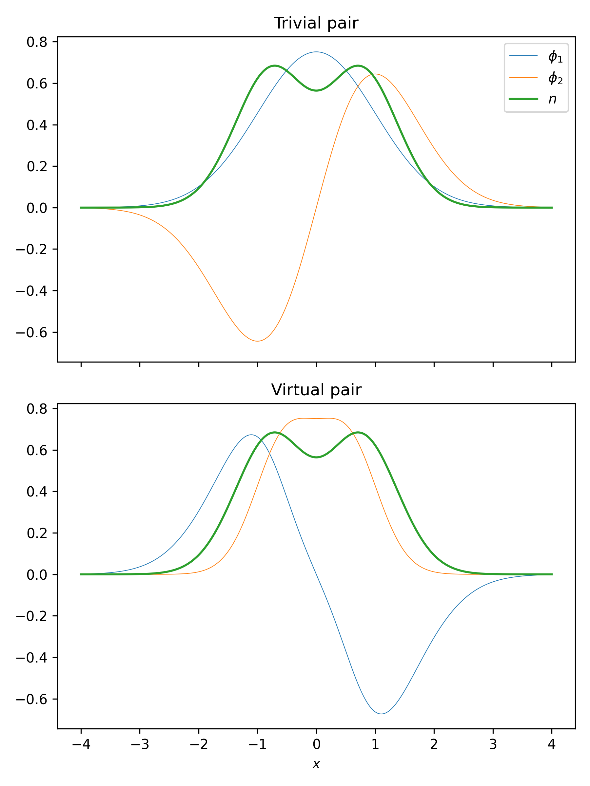

# Real Counter Example

To find a counter example to the challenge, we just have to find two sets of wavefunctions $\{\phi_1, \phi_2\}$ with the same density $n$ and different kinetic energy $T$.

## First set

Let's choose the trivial wavefunction pair

$$
    \begin{aligned}
        \phi_1(x) &= h_0(x) = \frac{e^{-\frac{x^2}{2}}}{\sqrt{\sqrt{\pi}}}H_0(x) = \frac{e^{-\frac{x^2}{2}}}{\sqrt{\sqrt{\pi}}} && \text{where $h_n$ are the Hermite functions} \\
        \phi_2(x) &= h_1(x) = \frac{e^{-\frac{x^2}{2}}}{\sqrt{2\sqrt{\pi}}}H_1(x) = \sqrt{\frac{2}{\sqrt{\pi}}}e^{-\frac{x^2}{2}}x && \text{where $H_n$ are the Hermite polynomials}
    \end{aligned}
$$

with their derivatives

$$
    \begin{aligned}
        \phi_1'(x) &= \frac{\mathrm{d}}{\mathrm{d}x}\frac{e^{-\frac{x^2}{2}}}{\sqrt{\sqrt{\pi}}} = -\frac{e^{-\frac{x^2}{2}}x}{\sqrt{\sqrt{\pi}}} \\
        \phi_2'(x) &= \frac{\mathrm{d}}{\mathrm{d}x}\sqrt{\frac{2}{\sqrt{\pi}}}e^{-\frac{x^2}{2}}x = -\sqrt{\frac{2}{\sqrt{\pi}}}e^{-\frac{x^2}{2}}(x^2-1)
    \end{aligned}
$$

their density

$$
    \begin{aligned}
        n(x) &= \phi_1(x)^2 + \phi_2(x)^2 \\
        &= \left(\frac{e^{-\frac{x^2}{2}}}{\sqrt{\sqrt{\pi}}}\right)^2 + \left(\sqrt{\frac{2}{\sqrt{\pi}}}e^{-\frac{x^2}{2}}x\right)^2 \\
        &= \frac{e^{-x^2}}{\sqrt{\pi}} + \frac{2e^{-x^2}x^2}{\sqrt{\pi}} \\
        &= \frac{e^{-x^2}}{\sqrt{\pi}}\left(2x^2+1\right)
    \end{aligned}
$$

and their kinetic energy

$$
    \begin{aligned}
        T &= \frac{1}{2}\int_\mathbb{R}\phi_1'(x)^2+\phi_2'(x)^2\,\mathrm{d}x \\
        &= \frac{1}{2}\int_\mathbb{R}\left(-\frac{e^{-\frac{x^2}{2}}x}{\sqrt{\sqrt{\pi}}}\right)^2+\left(-\sqrt{\frac{2}{\sqrt{\pi}}}e^{-\frac{x^2}{2}}(x^2-1)\right)^2\,\mathrm{d}x \\
        &= \frac{1}{2}\int_\mathbb{R}\frac{e^{-x^2}x^2}{\sqrt{\pi}}+\frac{2e^{-x^2}}{\sqrt{\pi}}(x^4-2x^2+1)\,\mathrm{d}x \\
        &= \frac{1}{2\sqrt{\pi}}\int_\mathbb{R}e^{-x^2}(2x^4-3x^2+2)\,\mathrm{d}x \\
        &= \frac{1}{2\sqrt{\pi}}2\sqrt{\pi} \\
        &= 1
    \end{aligned}
$$

## Second set

Now we can construct some "virtual" wavefunctions with the same density like described in [[3 Explicit Real Construction]]:

$$
    \begin{aligned}
        s(x) &= \int_{-\infty}^xn(y)\,\mathrm{d}y \\
        &= \int_{-\infty}^x\frac{e^{-y^2}}{\sqrt{\pi}}\left(2y^2+1\right)\,\mathrm{d}y &&= \text{erf}(x)+1-\frac{e^{-x^2}x}{\sqrt{\pi}} \\
        \alpha(x) &= \frac{\pi}{2}s(x) \\
        &= \frac{\pi}{2}\left(\text{erf}(x)-\frac{e^{-x^2}x}{\sqrt{\pi}}+1\right) &&= \frac{\pi}{2}(\text{erf}(x)+1)-\frac{\sqrt{\pi}}{2}e^{-x^2}x \\
        \phi_1(x) &= \sqrt{n(x)}\cos\alpha(x) \\
        &= \sqrt{\frac{e^{-x^2}}{\sqrt{\pi}}\left(2x^2+1\right)}\cos\left(\frac{\pi}{2}(\text{erf}(x)+1)-\frac{\sqrt{\pi}}{2}e^{-x^2}x\right) &&= \frac{e^{-\frac{x^2}{2}}}{\sqrt{\sqrt{\pi}}}\sqrt{2x^2+1}\cos\left(\frac{\pi}{2}(\text{erf}(x)+1)-\frac{\sqrt{\pi}}{2}e^{-x^2}x\right) \\
        \phi_2(x) &= \sqrt{n(x)}\sin\alpha(x) \\
        &= \sqrt{\frac{e^{-x^2}}{\sqrt{\pi}}\left(2x^2+1\right)}\sin\left(\frac{\pi}{2}(\text{erf}(x)+1)-\frac{\sqrt{\pi}}{2}e^{-x^2}x\right) &&= \frac{e^{-\frac{x^2}{2}}}{\sqrt{\sqrt{\pi}}}\sqrt{2x^2+1}\sin\left(\frac{\pi}{2}(\text{erf}(x)+1)-\frac{\sqrt{\pi}}{2}e^{-x^2}x\right)
    \end{aligned}
$$

Their kinetic energy is

$$
    \begin{aligned}
        T &= \frac{1}{8}\int_\mathbb{R}\frac{n'^2(x)}{n(x)}+\pi^2n^3(x)\,\mathrm{d}x \\
        &= \frac{1}{8}\int_\mathbb{R}\frac{\left(\frac{\mathrm{d}}{\mathrm{d}x}\frac{e^{-x^2}}{\sqrt{\pi}}\left(2x^2+1\right)\right)^2}{\frac{e^{-x^2}}{\sqrt{\pi}}\left(2x^2+1\right)}+\pi^2\left(\frac{e^{-x^2}}{\sqrt{\pi}}\left(2x^2+1\right)\right)^3\,\mathrm{d}x \\
        &= \frac{1}{8}\int_\mathbb{R}\frac{\left(-2\frac{e^{-x^2}}{\sqrt{\pi}}(2x^3-x)\right)^2}{\frac{e^{-x^2}}{\sqrt{\pi}}\left(2x^2+1\right)}+\pi^2\left(\frac{e^{-x^2}}{\sqrt{\pi}}\left(2x^2+1\right)\right)^3\,\mathrm{d}x \\
        &= \frac{1}{8}\int_\mathbb{R}\frac{4\frac{e^{-2x^2}}{\pi}(2x^3-x)^2}{\frac{e^{-x^2}}{\sqrt{\pi}}\left(2x^2+1\right)}+\pi^2\frac{e^{-3x^2}}{\sqrt{\pi}^3}\left(2x^2+1\right)^3\,\mathrm{d}x \\
        &= \frac{1}{8}\int_\mathbb{R}\frac{4}{\sqrt{\pi}}e^{-x^2}\frac{4x^6-4x^4+x^2}{2x^2+1}+\frac{\sqrt{\pi}}{8}e^{-3x^2}\left(2x^2+1\right)^3\,\mathrm{d}x \\
        &\qquad\mid \frac{4x^6-4x^4+x^2}{2x^2+1}=2x^4-3x^2+2-\frac{2}{2x^2+1} \\
        &\qquad\mid \left(2x^2+1\right)^3=8x^6+12x^4+6x^2+1 \\
        &= \frac{1}{8}\int_\mathbb{R}\frac{4}{\sqrt{\pi}}e^{-x^2}\left(2x^4-3x^2+2-\frac{2}{2x^2+1}\right)+\sqrt{\pi}e^{-3x^2}\left(8x^6+12x^4+6x^2+1\right)\,\mathrm{d}x \\
        &\qquad\mid \int_\mathbb{R}e^{-ax^2}x^n\,\mathrm{d}x=\begin{cases}
            \sqrt{\frac{\pi}{a}}\frac{(n-1)!!}{(2a)^\frac{n}{2}} & n\in\mathbb{G} \\
            0 & n\in\mathbb{U}
        \end{cases} \\
        &\qquad\mid \int_\mathbb{R}\frac{e^{-x^2}}{2x^2+1}\,\mathrm{d}x=\sqrt{\frac{e}{2}}\pi\text{erfc}\frac{1}{\sqrt{2}} \\
        &= \frac{1}{8}\left(\frac{4}{\sqrt{\pi}}\left(2\sqrt{\pi}\frac{3!!}{2^2}-3\sqrt{\pi}\frac{1!!}{2^1}+2\sqrt{\pi}\frac{(-1)!!}{2^0}-2\sqrt{\frac{e}{2}}\pi\text{erfc}\frac{1}{\sqrt{2}}\right)\right. \\
        &\qquad \left.+\sqrt{\pi}\left(8\sqrt{\frac{\pi}{3}}\frac{5!!}{6^3}+12\sqrt{\frac{\pi}{3}}\frac{3!!}{6^2}+6\sqrt{\frac{\pi}{3}}\frac{1!!}{6^1}+\sqrt{\frac{\pi}{3}}\frac{(-1)!!}{6^0}\right)\right) \\
        &= \frac{1}{8}\left(4\left(2\frac{3}{4}-3\frac{1}{2}+2-2\sqrt{\frac{e\pi}{2}}\text{erfc}\frac{1}{\sqrt{2}}\right)\right. \\
        &\qquad \left.+\frac{\pi}{\sqrt{3}}\left(8\frac{15}{216}+12\frac{3}{36}+6\frac{1}{6}+1\right)\right) \\
        &= \frac{1}{8}\left(8-8\sqrt{\frac{e\pi}{2}}\text{erfc}\frac{1}{\sqrt{2}}+\frac{\pi}{\sqrt{3}}\frac{32}{9}\right) \\
        &= 1+\frac{\pi}{\sqrt{3}}\frac{4}{9}-\sqrt{\frac{e\pi}{2}}\text{erfc}\frac{1}{\sqrt{2}} \\
        &= 1.150\dots
    \end{aligned}
$$

## Numerical verification

```python
import numpy as np
from scipy.special import erf
from scipy.integrate import quad
import matplotlib.pyplot as plt

fig, axs = plt.subplots(nrows=2, sharex=True, sharey=True, figsize=(6, 8))


#initial set of wavefunctions
phi1_1 = lambda x: np.exp(-x**2/2) / np.sqrt(np.sqrt(np.pi))
phi1_2 = lambda x: np.exp(-x**2/2)*x * np.sqrt(2 / np.sqrt(np.pi))
phip1_1 = lambda x: -np.exp(-x**2/2)*x / np.sqrt(np.sqrt(np.pi)) #phi_1'
phip1_2 = lambda x: -np.exp(-x**2/2)*(x**2-1)*np.sqrt(2/np.sqrt(np.pi)) #phi_2'
n1 = lambda x: phi1_1(x)**2 + phi1_2(x)**2

assert np.isclose(quad(lambda x: phi1_1(x)**2, -np.inf, +np.inf)[0], 1) #normalisation of phi_1
assert np.isclose(quad(lambda x: phi1_2(x)**2, -np.inf, +np.inf)[0], 1) #normalisation of phi_2
assert np.isclose(quad(lambda x: phi1_1(x)*phi1_2(x), -np.inf, +np.inf)[0], 0) #orthogonalisation
assert np.isclose(quad(n1, -np.inf, +np.inf)[0], 2) #normalisation of n
assert np.isclose(quad(lambda x: (phip1_1(x)**2+phip1_2(x)**2)/2, -np.inf, +np.inf)[0], 1) #T

x = np.linspace(-4, +4, 1000)
axs[0].set_title('Trivial pair')
axs[0].plot(x, phi1_1(x), lw=0.5, label=r'$\phi_1$')
axs[0].plot(x, phi1_2(x), lw=0.5, label=r'$\phi_2$')
axs[0].plot(x, n1(x), label='$n$')
axs[0].legend()


#second, "virtual", set of wavefunctions
s = lambda x: erf(x) - np.exp(-x**2)*x/np.sqrt(np.pi) + 1
a = lambda x: np.pi/2 * s(x)
phi2_1 = lambda x: np.sqrt(n1(x)) * np.cos(a(x))
phi2_2 = lambda x: np.sqrt(n1(x)) * np.sin(a(x))
n2 = lambda x: phi2_1(x)**2 + phi2_2(x)**2
n_p = lambda x: 2*(phi1_1(x)*phip1_1(x)+phi1_2(x)*phip1_2(x))

assert np.isclose(quad(lambda x: phi2_1(x)**2, -np.inf, +np.inf)[0], 1) #normalisation of phi_1
assert np.isclose(quad(lambda x: phi2_2(x)**2, -np.inf, +np.inf)[0], 1) #normalisation of phi_2
assert np.isclose(quad(lambda x: phi2_1(x)*phi2_2(x), -np.inf, +np.inf)[0], 0) #orthogonalisation
assert np.allclose(n1(x), n2(x)) #equivalence of n
assert np.isclose(quad(lambda x: (n_p(x)**2/n1(x) if not np.isclose(n1(x), 0) else 0)+np.pi**2*n1(x)**3, -np.inf, +np.inf)[0]/8, 1.150453508351965017) #T

axs[1].set_title('Virtual pair')
axs[1].plot(x, phi2_1(x), lw=0.5)
axs[1].plot(x, phi2_2(x), lw=0.5)
axs[1].plot(x, n2(x))
axs[1].set_xlabel('$x$')


fig.tight_layout()
fig.savefig('plot.png', dpi=300)
#plt.show()
```

